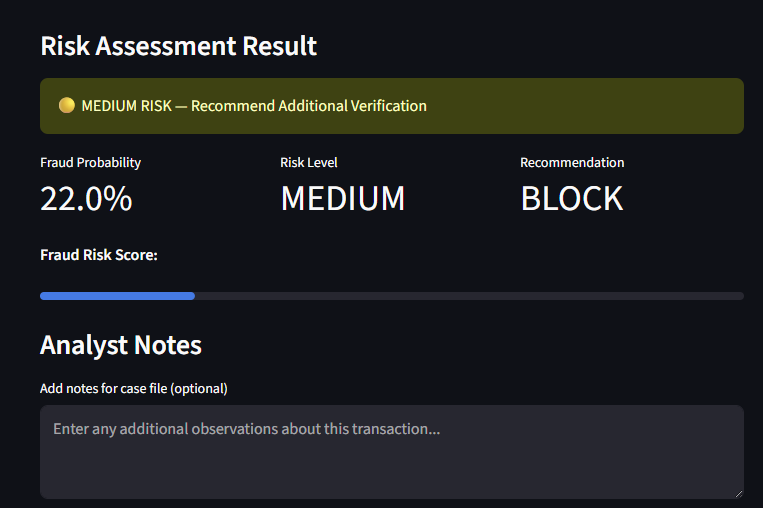
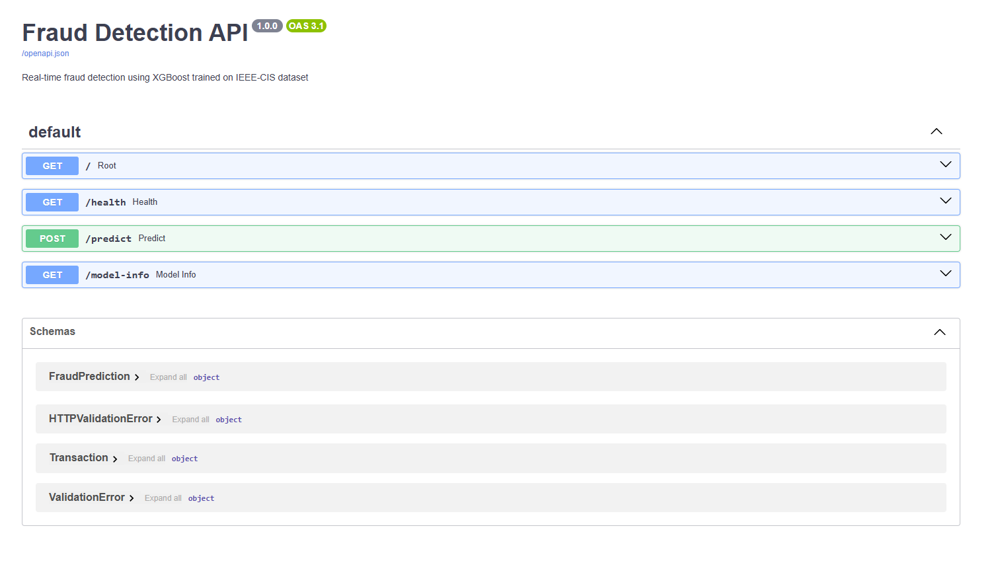

# 🔍 Fraud Detection System

[](https://financial-risk-analyser.streamlit.app)
[](https://fraud-detection-api-tg28.onrender.com)
[](https://fraud-detection-api-tg28.onrender.com/docs)
[](https://www.python.org/)
[](https://xgboost.readthedocs.io/)
[](https://www.docker.com/)

A real-time fraud detection system built with XGBoost, served via a FastAPI endpoint, containerised with Docker, and deployed on Render. Includes an internal analyst-facing Streamlit interface for transaction risk assessment.

🔗 **[Live Analyst Tool](https://financial-risk-analyser.streamlit.app)**
🔗 **[Live API](https://fraud-detection-api-tg28.onrender.com)**
📖 **[API Documentation](https://fraud-detection-api-tg28.onrender.com/docs)**

---

## Analyst Tool Preview



---

## API Documentation



---

## Business Problem

Financial fraud costs institutions billions annually. This system provides real-time transaction risk scoring — every transaction is assessed against 200 behavioural and transactional signals, returning a fraud probability and risk level in milliseconds.

The system is designed for two users:
- **Fraud analysts** — use the Streamlit interface to manually assess flagged transactions
- **Payment systems** — integrate directly with the REST API for automated real-time scoring

---

## Model Performance

| Metric | Value |
|---|---|
| ROC-AUC | 0.9262 |
| Precision (Fraud, default threshold) | 0.88 |
| Recall (Fraud, default threshold) | 0.47 |
| Recall (Fraud, optimal threshold) | 0.75 |
| Optimal Classification Threshold | 0.056 |
| Training Samples | 120,000 |
| Test Samples | 30,000 |

---

## Key Technical Decisions

**SMOTE for class imbalance.** The dataset has a 2.65% fraud rate. A naive model predicting "not fraud" for everything achieves 97.35% accuracy but catches zero fraud. SMOTE synthetically generates fraud examples in the training set raising the fraud rate to 16.67%, significantly improving recall. SMOTE is applied to training data only — the test set remains at 2.65% for honest evaluation.

**Threshold tuning over default 0.5.** Default threshold achieves 88% precision but only 47% recall — missing 53% of fraud. Lowering to 0.056 raises recall to 75%. In banking, missing real fraud is more costly than false positives. This tradeoff is a deliberate business decision, not a model flaw.

**XGBoost for tabular fraud data.** Gradient boosting handles complex feature interactions and anonymised behavioural signals more effectively than linear models or random forests on this dataset. Achieved 0.926 ROC-AUC.

**Docker for consistent deployment.** The FastAPI endpoint is containerised ensuring identical behaviour across local development, staging, and production environments.

**Google Colab for initial sampling.** Full dataset is 667MB — exceeding available RAM on development machine. Initial sampling of 150,000 transactions performed in Google Colab, documented as a resourcefulness signal. All subsequent processing and training performed locally.

---

## Streamlit Demo Limitation

The analyst tool exposes 6 key features for manual input. Remaining features default to 0. In production, all 200 features would be populated automatically from the payment system producing accurate real-time predictions. The demo illustrates the analyst workflow rather than serving as a fully accurate standalone predictor.

---

## API Endpoints

| Method | Endpoint | Description |
|---|---|---|
| GET | `/` | API status |
| GET | `/health` | Health check |
| POST | `/predict` | Score a transaction |
| GET | `/model-info` | Model metadata |

**Example request:**
```bash
curl -X POST https://fraud-detection-api-tg28.onrender.com/predict \
  -H "Content-Type: application/json" \
  -d '{
    "features": {
      "TransactionAmt": 150.0,
      "ProductCD": 1,
      "card3": 150,
      "V57": 0.5,
      "C12": 1.0,
      "V30": 0.5
    }
  }'
```

**Example response:**
```json
{
  "transaction_id": "unknown",
  "fraud_probability": 0.2202,
  "is_fraud": true,
  "risk_level": "MEDIUM",
  "threshold_used": 0.0563
}
```

---

## Methodology

**Data:** 150,000 transactions sampled from the IEEE-CIS Fraud Detection Kaggle competition dataset. Transaction and identity datasets merged on TransactionID giving 434 raw features.

**Preprocessing:** 232 columns with more than 50% missing values dropped. Remaining nulls imputed with median for numeric and mode for categorical columns. 5 categorical columns label encoded. Final feature set — 200 features.

**Class Imbalance:** SMOTE applied to training set only. Fraud rate increased from 2.65% to 16.67% in training data.

**Modelling:** XGBoost trained with 200 estimators, max depth 6, learning rate 0.1. Evaluated on ROC-AUC, precision, recall, F1. Threshold tuned to optimise recall for fraud class.

**Deployment:** FastAPI endpoint containerised with Docker, deployed on Render. Streamlit analyst interface deployed on Streamlit Cloud.

---

## Project Structure
```
fraud-detection/
├── app/
│   ├── main.py                  # FastAPI application
│   └── streamlit_app.py         # Streamlit analyst interface
├── assets/                      # Screenshots
├── data/
│   ├── raw/                     # IEEE-CIS dataset (not pushed — see Kaggle)
│   └── processed/               # Sampled dataset (not pushed)
├── models/
│   ├── fraud_model.pkl          # Trained XGBoost model
│   ├── feature_names.pkl        # Feature names for API
│   └── threshold.pkl            # Optimal classification threshold
├── notebooks/
│   └── fraud_detection.ipynb    # Full analysis and training notebook
├── Dockerfile                   # Container definition
├── requirements.txt             # Streamlit Cloud dependencies
└── README.md
```

---

## How to Run Locally
```bash
# Clone the repository
git clone https://github.com/atharvakatkar/fraud-detection.git
cd fraud-detection

# Option 1 — Run API with Docker
docker build -t fraud-detection .
docker run -p 8000:8000 fraud-detection

# Option 2 — Run API without Docker
pip install fastapi uvicorn pandas numpy scikit-learn xgboost joblib
uvicorn app.main:app --reload --port 8000

# Option 3 — Run Streamlit app
pip install streamlit requests
streamlit run app/streamlit_app.py
```

---

## Future Work

- Populate all 200 features in Streamlit demo for accurate standalone predictions
- Add MLflow experiment tracking for model versioning
- Implement feature drift detection to monitor model degradation over time
- Retrain on full 590,000 transaction dataset using cloud compute
- Add analyst notes persistence to a case management database
- Add API authentication for production security

---

## Tech Stack

Python, XGBoost, Scikit-Learn, imbalanced-learn, FastAPI, Pydantic, Streamlit, Docker, Render, Streamlit Cloud, Pandas, NumPy, Google Colab

---

## Author

**Atharva Katkar**
[GitHub](https://github.com/atharvakatkar) | [LinkedIn](https://www.linkedin.com/in/ankatkar)

*Data Science Student — Macquarie University*